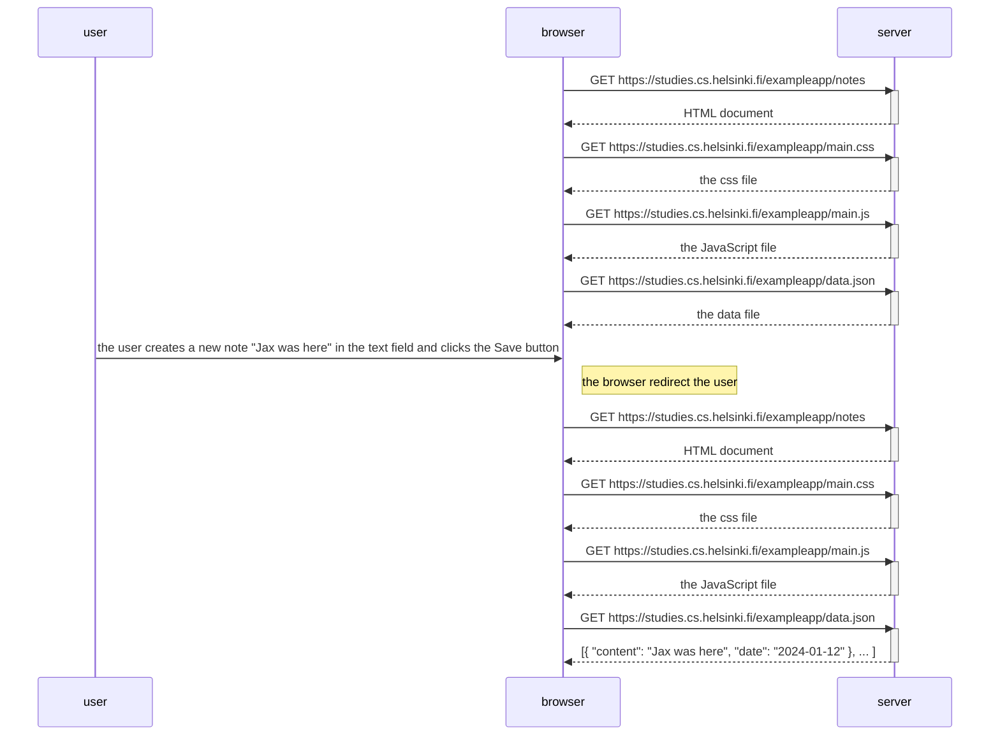
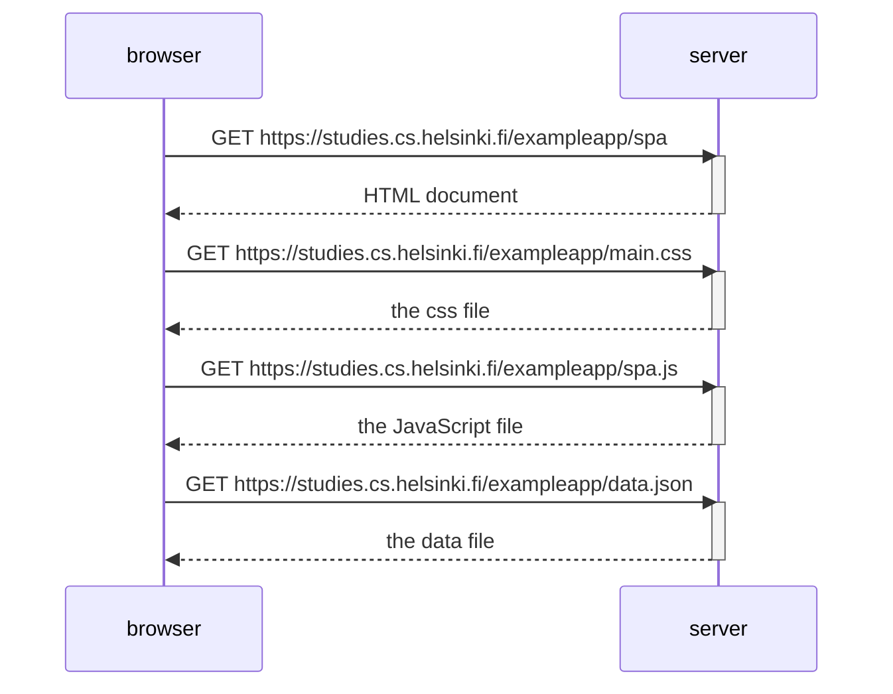
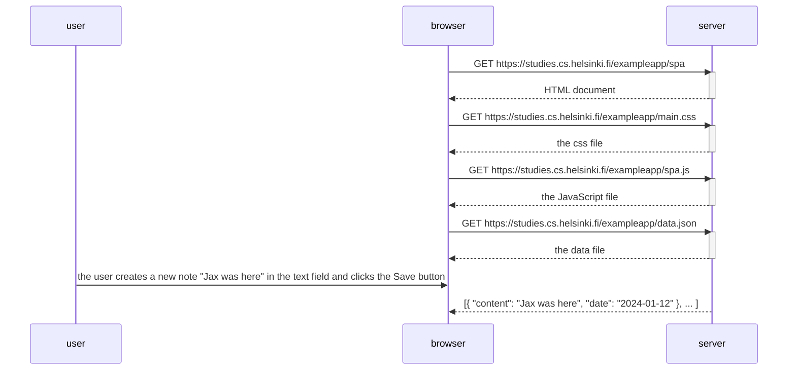

```mermaid

%%EXERCISE 0.4

sequenceDiagram
participant user
participant browser
participant server

browser->>server: GET https://studies.cs.helsinki.fi/exampleapp/notes
    activate server
    server-->>browser: HTML document
    deactivate server

    browser->>server: GET https://studies.cs.helsinki.fi/exampleapp/main.css
    activate server
    server-->>browser: the css file
    deactivate server

    browser->>server: GET https://studies.cs.helsinki.fi/exampleapp/main.js
    activate server
    server-->>browser: the JavaScript file
    deactivate server

%%The browser starts executing the JavaScript code that fetches the JSON from the server

    browser->>server: GET https://studies.cs.helsinki.fi/exampleapp/data.json
    activate server
    server-->>browser: the data file
    deactivate server

    %%The browser executes the callback function that renders the notes to display

    user ->> browser: the user creates a new note "Jax was here" in the text field and clicks the Save button

    %% the browser creates a new note which is a POST to the server
    %%the server starts execute the text field function
    note right of browser: the browser redirect the user

browser->>server: GET https://studies.cs.helsinki.fi/exampleapp/notes
    activate server
    server-->>browser: HTML document
    deactivate server

    browser->>server: GET https://studies.cs.helsinki.fi/exampleapp/main.css
    activate server
    server-->>browser: the css file
    deactivate server

    browser->>server: GET https://studies.cs.helsinki.fi/exampleapp/main.js
    activate server
    server-->>browser: the JavaScript file
    deactivate server

%%The browser starts executing the JavaScript code that fetches the JSON from the server

    browser->>server: GET https://studies.cs.helsinki.fi/exampleapp/data.json
    activate server
    server-->>browser: [{ "content": "Jax was here", "date": "2024-01-12" }, ... ]
    deactivate server

%%The browser executes the callback function that renders the notes to display
```

```mermaid
%%EXERCISE 0.5
sequenceDiagram
    participant browser
    participant server

browser->>server: GET https://studies.cs.helsinki.fi/exampleapp/spa
    activate server
    server-->>browser: HTML document
    deactivate server

    browser->>server: GET https://studies.cs.helsinki.fi/exampleapp/main.css
    activate server
    server-->>browser: the css file
    deactivate server

    browser->>server: GET https://studies.cs.helsinki.fi/exampleapp/spa.js
    activate server
    server-->>browser: the JavaScript file
    deactivate server

%%The browser starts executing the JavaScript code that fetches the JSON from the server

    browser->>server: GET https://studies.cs.helsinki.fi/exampleapp/data.json
    activate server
    server-->>browser: the data file
    deactivate server
```

```mermaid
%%EXERCISE 0.6
sequenceDiagram
participant user
participant browser
participant server

browser->>server: GET https://studies.cs.helsinki.fi/exampleapp/spa
    activate server
    server-->>browser: HTML document
    deactivate server

    browser->>server: GET https://studies.cs.helsinki.fi/exampleapp/main.css
    activate server
    server-->>browser: the css file
    deactivate server

    browser->>server: GET https://studies.cs.helsinki.fi/exampleapp/spa.js
    activate server
    server-->>browser: the JavaScript file
    deactivate server

%%The browser starts executing the JavaScript code that fetches the JSON from the server

    browser->>server: GET https://studies.cs.helsinki.fi/exampleapp/data.json
    activate server
    server-->>browser: the data file
    deactivate server

    %%The browser executes the callback function that renders the notes to display

    user ->> browser: the user creates a new note "Jax was here" in the text field and clicks the Save button

    %% the browser creates a new note which is a POST to the server
    %%the server starts execute the text field function
    %%the server does not redirect the user, it uses a function to redraw Notes and load at the same time, use the windows.onload function

    server-->>browser: [{ "content": "Jax was here", "date": "2024-01-12" }, ... ]
```